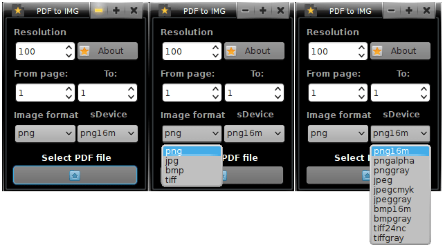
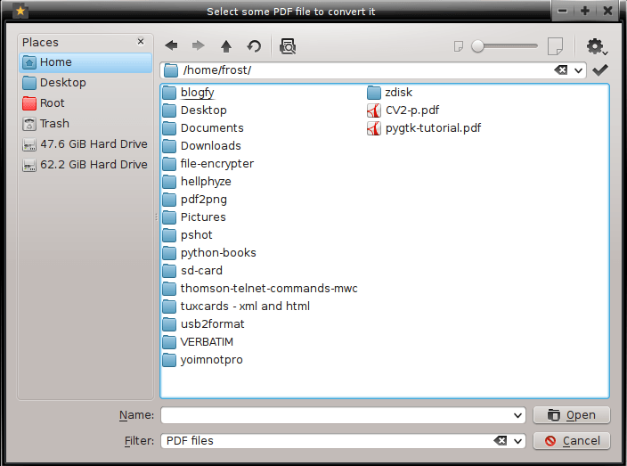

pdf2img
=======

pdf2img is a small and open source graphical application written in Python and designed to act as a quick solution for converting PDF files to image files.

pdf2img features support for four different image formats, including PNG, JPG, BMP, and TIFF, as well as support for ten Ghostscript devices, including png16m, pngalpha, pnggray, jpeg, jpegcmyk, jpeggray, bmp16m, bmpgray, tiff24nc, and tiffgray.

Before the actual conversion, users will be able to set the resolution of the output image, as well as to specify the pages they want to convert. The software can convert multiple PDF pages at once, into multiple images, with a single mouse click.

There are 3 versions of pdf2img, the first one was written in python using pygobject toolkit, the second one again in python but with python port of qt4, and the third one (new one) written in C using gtk3.

## Archlinux support
Archlinux users can install the program directly from AUR, without the need to download it from here.

    yaourt -S pdf2img-git

## Downloaded from here
Once you download the program, before starting it copy img/pdf2img_icon.png to /usr/share/pixmaps

    sudo cp img/pdf2img_icon.png /usr/share/pixmaps

11/11/13 name changed, from pdf2png to pdf2img and I'm saying huge THANK YOU to Aaditya Bagga.
## Requirements

* ghostscript
* python2
* python2-pyqt4